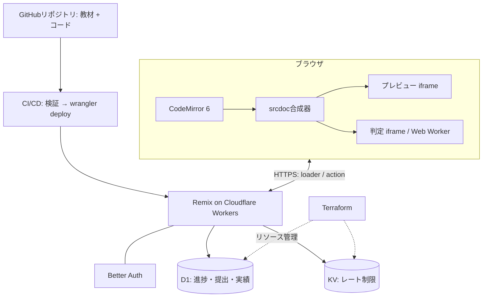
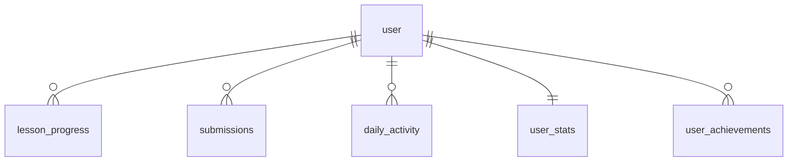

# Web学習プラットフォーム Design Doc

| 項目 | 内容 |
|---|---|
| Status | Draft v1.3 |
| 日付 | 2026-07-09 |
| サービス名 | 未定(本書では「本サービス」と表記) |
| 対象読者 | 実装者 |
| スコープ | MVP(一般公開開始まで) |

---

## 1. 概要

### 1.1 目的

HTML / CSS / JavaScript をゼロからステップアップで学べる、一般公開のWeb学習サービスを構築する。学習体験はProgateを参照モデルとし、「解説スライド(紙芝居) → アプリ内エディタで演習 → 提出して即時判定 → クリア」のループを核とする。

### 1.2 スコープ / 非スコープ

**MVPに含む**: HTML・CSS・JS の3コース / Googleログイン / 進捗保存 / バッジとストリーク / マイページ / PC前提のUI(閲覧系ページと演習画面の簡易版のみレスポンシブ対応)。

**MVPに含まない(将来課題)**: 有料プラン、修了証明書(サーバー側再判定が前提になるため)、多言語対応、モバイル専用UI、コミュニティ機能、教材の管理画面(CMS)。

### 1.3 設計原則

本書のすべての決定は以下の原則に紐づく。各節で `[原則名]` として参照する。

| 原則 | 意味 | 主な適用先 |
|---|---|---|
| コンテンツはコード | 教材はGit管理されたファイルが唯一の正(SSOT)。DBはユーザー状態のみ持つ | §4, §7 |
| 最小権限 / サンドボックス | 信頼できないコードは隔離環境でのみ実行し、サーバーに実行の口を作らない | §6 |
| 振る舞いをテストする | 文字列一致ではなく結果(DOM / computed style / 戻り値)を検証する | §5 |
| 決定性 | 同じ提出は誰の環境・どの時刻でも同じ判定になる | §5, §6 |
| フェイルセーフ / 多層防御 | 想定外の入力があっても最悪「タイムアウト不合格」で着地する | §5, §6 |
| 表示は1件・記録は全件 | 学習者への表示は認知負荷最小に、分析用データは欠かさず残す | §5, §7 |
| 冪等性 | 同じ操作の重複実行をDB制約(PK / UNIQUE)で無害化する | §7, §9 |
| 脅威モデル相応の防御 | 不正して損をするのが本人だけの箇所に高コストな防御を積まない | §9 |
| ホットパスのみ実体化 | 導出可能な値は保存しない。ただし読み取り頻度の高い集計は実体化する | §7 |
| 1リソース1オーナー | 各リソースの管理主体を一意にする(Terraform / wrangler / drizzle-kit) | §11 |
| expand and contract | スキーマ変更は後方互換な拡張を先行させ、収縮は次リリースで行う | §11 |
| one-way doorを先に固める | 変更コストの高い決定(インターフェース・永続データ)を設計書で確定する | 本書全体 |
| サーバーサイド認可 | UIの出し分けはセキュリティではない。秘匿情報はサーバーで検証してから返す | §4, §9 |

### 1.4 用語

- **コース**: HTML入門 などの単位。順序付きのレッスン列を持つ
- **レッスン**: スライドn枚 + 演習1つ の単位。進捗・ストリーク・バッジの粒度
- **check**: 演習の合格条件1つ。宣言的ルールまたはカスタム関数
- **verdict**: 判定エンジンが返す結果オブジェクト(§5.1)
- **判定バンドル**: レッスンのchecksとランナーをビルド時に束ねたJS(§4.2)

---

## 2. プロダクト仕様

### 2.1 学習フロー

```
コース選択 → レッスン開始
  → スライド 1..n(紙芝居、←→キー移動、次スライドをプリフェッチ)
  → 演習(編集 ⇄ プレビュー、ヒント、提出)
      ├ 不合格: 最初に失敗した1件のみメッセージ表示。失敗回数を加算
      └ 合格: クリア画面(ストリーク更新・バッジ獲得を同一画面で演出)→ 次レッスンへ
```

スライドを紙芝居形式にするのは分割提示の原則(Mayerのセグメント化: 学習者ペースの小分け提示が理解を高める)による。不合格表示を1件に絞るのは認知負荷理論(直すべきことは一度に一つ)による。クリア画面に演出を集中させるのはピークエンドの法則(体験の記憶は感情のピークと終わりで決まる)による。

### 2.2 ルーティング

| ルート | 内容 |
|---|---|
| `_index.tsx` | LP(サービス紹介) |
| `courses._index.tsx` | コース一覧 |
| `courses.$course.tsx` | レッスン一覧 + 進捗バー |
| `courses.$course.$lesson.slides.$n.tsx` | 解説スライド(1..n) |
| `courses.$course.$lesson.exercise.tsx` | 演習 |
| `me.tsx` | マイページ(進捗・バッジ・ストリーク・自分の解答) |
| `api.auth.$.tsx` | Better Auth キャッチオール |

学習位置(スライド何枚目・演習中)がURLそのものになる `[URL as State]`。「続きから再開」はマイページからのリダイレクト一発で実現する。各ルートのloaderがそのURLに必要なデータ(レッスン定義+進捗+ヒント開放状態)を1回で返す(コロケーション)。

### 2.3 演習画面

3ペイン構成: 左=手順(指示・スライドへ戻る・ヒントボタン) / 中央=エディタ(ファイルタブ) / 右=プレビュー(「あなたの結果」「見本」「コンソール」タブ)+ 判定メッセージ欄(位置固定)。下部バーに リセット / 答えを見る / できた!(提出)。

- **ファイルタブ**: `editable: false` のファイルは鍵アイコン付き読み取り専用。触れる場所を視覚で限定する(認知負荷の削減)
- **プレビュー更新**: HTML / CSS はタイプに追従(デバウンス300ms)。JS は「実行」ボタンまたは Cmd/Ctrl+Enter で明示実行(§6の無限ループ対策と整合)
- **見本タブ**: 「solutionを学習者と同一の実行系に通した結果」を見本と定義する。dom系レッスンは合成パイプライン(§6.1)によるスクロール・操作可能なライブ描画、コンソール主体のworker系レッスンはsolutionをWeb Workerで実行して捕捉したコンソール出力を表示する。期待出力を手書きで併記せずsolutionから毎回導出するため、二重管理が発生しない `[SSOT]`。ワークトエグザンプル効果(完成例の提示は初学者に最も効率の良い学習材料)による。DevToolsで内部を読み取れることは§2.4の方針として許容する
- **コンソールタブ**: iframe / Worker内の console 出力を捕捉して表示
- **新規タブで開く**: 合成済みHTMLを Blob URL で実ブラウザタブに開くボタンを設置
- **判定メッセージ**: 右下固定。不合格時は最初に失敗した1件のみ。合格時は成功表示に切り替わる
- **エディタ**: CodeMirror 6。シンタックスハイライトあり、**自動補完はオフ**(生成効果: 自力で想起して書く方が記憶に定着する。中級以降のコースで解禁を検討)。全角検出lint(§5.4)を接続
- **下書き自動保存**: `localStorage` に `draft:{lessonSlug}` キーで1秒デバウンス保存、再訪時に復元。リセットボタンで初期コードに戻し下書きも破棄(作業損失の防止。サーバー保存はYAGNI)

### 2.4 ヒントと「答えを見る」

- ヒントは累計失敗回数で段階開放する: **失敗2回ごとに1つ**(`開放数 = min(floor(failed_count / 2), ヒント総数)`)
- 「答えを見る」は**全ヒント開放後**(`failed_count >= 2 × ヒント総数`)にのみ有効化
- この開放制御の目的は**秘匿ではなく学習設計上の摩擦**(安易に答えへ飛べない正規導線の設計)である。見本タブのライブレンダリング(§2.3)により solution はクライアントに存在し、DevToolsで抽出可能なことを許容する `[脅威モデル相応の防御]`: 抜け道を使って損をするのは本人だけであり、正規UIの導線制御で目的は達成される。開放状態の正はサーバーの `failed_count`(§7.3)で、loaderが開放数を返しクライアントが表示を切り替える
- 答えを閲覧した事実は `solution_viewed_at` に記録する(学習分析用。ペナルティには使わない)

### 2.5 ゲーミフィケーション(バッジ + ストリーク)

XP / レベル制は採用しない。ストリークの定義: **JSTで1日1回、いずれかの演習に合格**したら継続。記録はUTCで保持し日付境界の判定のみJST固定(将来のTZ対応時に遡って再計算可能)。

MVPバッジ一覧(定義はコード内、§9.3):

| achievement_id | 条件 |
|---|---|
| `first_pass` | 初めての合格 |
| `course_complete_{course}` | 各コースの全レッスン合格(3種) |
| `passed_10` / `passed_50` / `passed_100` | 累計合格数の節目 |
| `streak_7` / `streak_30` | ストリーク7日 / 30日 |

### 2.6 レスポンシブ方針

PC前提。ただし品質の段階的投資として: 閲覧系ページ(LP・コース一覧・スライド・マイページ)は通常のレスポンシブ対応、演習画面のみ md 未満で「手順 / コード / プレビュー」のタブ切替UIに落とす。コスト最大の3ペインレイアウトだけを簡略化する。

### 2.7 MVPカリキュラム骨子

| コース | レッスン数 | 内容の例 |
|---|---|---|
| HTML入門 | 10 | ページの骨格 / 見出しと段落 / リンク / 画像 / リスト / テーブル / フォーム / セマンティック要素 |
| CSS入門 | 10 | セレクタ / 色と文字 / ボックスモデル / display / Flexbox / 擬似クラス |
| JS入門 | 12 | 変数 / 演算 / 条件分岐 / ループ / 関数 / 配列 / オブジェクト / DOM取得 / イベント |

各レッスンは「写経 → 穴埋め → 自力」の順に難度を上げる(スキャフォールディング)。

---

## 3. アーキテクチャ

### 3.1 全体図



最重要の設計判断は**ユーザーコードの実行をすべてブラウザ内で完結させる**こと `[最小権限]`。題材がHTML/CSS/JSであるため、サーバー実行が本質的に不要。実行負荷はユーザー側に分散し、CPU時間制限のあるWorkersの特性とも整合する。サーバー(D1)の仕事は進捗と提出の記録のみ(関心の分離)。

### 3.2 技術スタック選定

| 領域 | 採用 | 理由(原則) | 却下案と理由 |
|---|---|---|---|
| フレームワーク | **React Router v7 framework mode**(Remix v2の直系後継・安定版。本書では慣用的に「Remix」と表記) | loader/actionモデルがURL as Stateと噛み合う。Cloudflare公式サポート。LTS | Next.js: Workersとの統合成熟度で劣後 / Remix 3: React非依存の別系統。2026-07時点βプレビューで公式が本番非推奨と明言(ADR #13) |
| ホスティング | Cloudflare Workers(静的アセット同梱) | エッジ低レイテンシ。D1/KVとのバインディング | Pages: 新規はWorkers推奨へ移行済み |
| DB | D1 (SQLite) + Drizzle ORM | Workersネイティブ。drizzle-kitでマイグレーション一元化 | 外部Postgres: MVPに過剰、レイテンシ増 |
| セッション補助 / レート制限 | KV | §8.2, §10.4 | — |
| 認証 | Better Auth(Google のみ) | 認証を自作しない。摩擦の最小化・データ最小化(パスワード非保持) | 自前実装: 攻撃面が増えるだけ |
| エディタ | CodeMirror 6 | Monaco比で大幅に軽量、タッチ対応も良好 | Monaco: バンドル数MB、モバイル弱 |
| 教材形式 | TS (`defineLesson`) + MDXスライド | コンテンツはコード。型+zodの二重検証 | DB格納: SSOTが割れる。CMS: YAGNI |
| IaC | Terraform(cloudflare provider) | 環境の再現性 | — |
| パッケージ管理 | pnpm workspaces | モノレポで契約パッケージを共有 | — |

### 3.3 リポジトリ構成

```
.
├─ app/                       # Remixアプリ本体
│   ├─ app/routes/
│   ├─ app/features/          # editor / judge-runner / auth / mypage / gamification
│   ├─ app/generated/         # 教材codegenの出力(コミットしない)
│   └─ drizzle/               # DBスキーマ + マイグレーション
├─ content/
│   └─ courses/
│       └─ html-basics/
│           ├─ course.ts
│           └─ lessons/03-headings/{lesson.ts, slides/01.mdx …}
├─ packages/
│   └─ lesson-kit/            # defineLesson / zodスキーマ / check型 / メッセージ生成 / 全角検出
├─ infra/terraform/
│   ├─ modules/
│   └─ envs/{dev,prod}
└─ .github/workflows/         # ci.yml / deploy.yml / infra.yml
```

依存方向: `content → lesson-kit ← app`。教材とアプリは互いに直接依存せず、契約パッケージにのみ依存する(契約への依存 = 依存性逆転の応用)。判定エンジンのうち「ルール解釈・メッセージ生成・全角検出」の純粋部分は lesson-kit に置き、DOMを触る実行部のみ app 側に置く(functional core, imperative shell)。純粋部分はブラウザなしのvitestで網羅的にテストする。

---

## 4. コンテンツシステム(lesson-kit)

### 4.1 defineLesson API

```ts
// packages/lesson-kit
export function defineLesson(def: LessonDef): LessonDef;

type LessonDef = {
  slug: string;                // 公開後は不変(安定識別子)。URL・DB外部キー相当を兼ねる
  title: string;
  estMinutes?: number;
  runner?: "dom" | "worker";   // 省略時: DOM系check(element/text/attribute/style)が1つでもあれば "dom"
  files: Record<string, {
    initial: string;
    editable?: boolean;        // 既定 true。false はエディタで鍵付き表示
    hidden?: boolean;          // 実行には含めるがタブに出さない(採点用の土台等)
  }>;
  checks: Check[];             // §5.2。上から評価し、表示は最初の失敗1件
  hints: string[];             // ★サーバー専用に分離される
  solution: Record<string, string>; // ★サーバー専用に分離される
};

export function defineCourse(def: {
  slug: string; title: string; description: string;
  lessons: string[];           // レッスンslugの順序付きリスト
}): CourseDef;
```

すべて zod スキーマで裏打ちし、ビルド時に全教材を parse する(Parse, don't validate: 境界で構造を保証すれば内側は型を信頼できる)。

### 4.2 教材ビルド(codegen)

`content/` を入力とする codegen が2種類の成果物を出力する:

| 出力 | 内容 | 参照元 |
|---|---|---|
| `app/generated/lessons.client.ts` | meta / files / hints / solution / 判定バンドル(すべてレッスン単位の遅延importチャンク) | 演習ルート |
| スライドコンポーネント | MDXコンパイル済み(レッスン単位のチャンク) | slidesルート |

> **設計変更の記録(v1.1)**: 当初は hints / solution を `.server.ts` モジュール境界で物理分離していたが、見本タブのライブレンダリング(§2.3)には solution のクライアント配信が不可欠で両立しない。開放制御の目的を「秘匿」から「学習摩擦」へ再定義(§2.4)し、物理分離を廃止した。副次効果として codegen と loader が単純化する(ADR #7)。

判定バンドル: checks にはカスタム関数が含まれJSONで運べないため、レッスンごとに「checks + ランナー」を esbuild で1ファイルに束ね、演習ルートが動的importで取得したうえで判定srcdocへ**文字列としてインライン**する(§6.5のCSPが外部スクリプトを禁じるため)。1バンドル数KB程度。

### 4.3 スライド(MDX)

1スライド = 1 MDXファイル。コードブロックのハイライトはビルド時に処理(Shiki等)し、クライアントにハイライタを載せない。スライドルートは次スライドをプリフェッチする。

### 4.4 教材のCI検証(2段構え)

1. **構造検証**: 全教材を zod で parse。slug重複・存在しないレッスン参照も検出
2. **自己整合性検証**: 各レッスンの **solution を判定エンジンにかけ、全checksに合格することを保証**する。solutionはchecksの生きたテストフィクスチャであり、「お手本が自分の合格条件を満たさない」教材バグを構造的に根絶する `[シフトレフト]`。実行はheadlessブラウザ(Playwright)上で本物の判定パイプラインを通す。加えて各レッスンの **initial(手つかずの初期コード)は判定が不合格になることも検証**する(何も書かずにクリアできる = checkの穴を検出する。詳細は docs/specs/J-judge-hardening.md §1)

---

## 5. 判定エンジン仕様

### 5.1 インターフェース

```ts
type Verdict = {
  passed: boolean;
  display: { checkId: string; message: string } | null; // 表示する最初の失敗
  details: { checkId: string; passed: boolean }[];      // 全チェックの結果(記録用)
  console: ConsoleEntry[];
  timedOut: boolean;
};

judge(lesson: ClientLesson, files: FileMap): Promise<Verdict>
```

全checkを評価し(各checkは読み取り専用クエリなので先行失敗後も安全に続行できる)、表示は最初の失敗のみ、記録は全件 `[表示は1件・記録は全件]`。

ランナーは2系統を `judge()` の裏に隠す(戦略パターン): `runner: "dom"` は判定専用iframe、`"worker"` はWeb Worker直接実行。呼び出し側はレッスン種別を意識しない。

判定は**ライブプレビューとは別の、毎回新規生成する非表示iframe**で行う。プレビューにはユーザー操作の残留状態が蓄積するため `[テストの独立性]`。判定iframeのビューポートは **800×600固定**。`%` や `vw` を使うCSS課題の結果が環境で変わらないため `[決定性]`。

### 5.2 check型カタログ

| type | 対象 | 主なフィールド | 既定メッセージ例 |
|---|---|---|---|
| `element` | DOM | `selector`, `count?` | 「<h1>タグが見つかりません」 |
| `text` | DOM | `selector`, `equals` / `contains` / `pattern` | 「<h1>の中身を『自己紹介』にしましょう」 |
| `attribute` | DOM | `selector`, `name`, `equals` / `exists` | 「imgタグにalt属性を付けましょう」 |
| `style` | CSSOM | `selector`, `property`(longhand限定), `equals` | 「h1の文字色がredになっていません」 |
| `source` | 原文 | `file`, `pattern` | (コメント・doctype等、DOM化で消える情報用) |
| `console` | JS | `lines`, `ordered?` | 「『Hello』がコンソールに出力されていません」 |
| `fn` | JS | `name`, `args`, `returns`(deepEqual) | 「add(1, 2) の戻り値が3ではありません」 |
| `custom` | 任意 | `run(ctx)` | 著者が定義(§5.6) |

- 既定メッセージはcheck型ごとのテンプレートからlesson-kitが生成し、著者は `message` で上書き可能。文言の一元管理はトーン統一のためのSSOT
- 入れ子構造の検証は専用typeを作らず、CSSセレクタ(`ul > li`)で表現する(既存の表現力を借り、DSL語彙を増やさない)

### 5.3 比較セマンティクス(正規化規則)

原則は「正規形に落としてから比較する」(canonicalization)。素朴な文字列比較は偽陰性の温床。

- **テキスト**: 既定で前後trim + 連続空白を1つに畳む(normalize-space)。`exact: true` で無効化、`ignoreCase` オプションあり
- **CSS**: 期待値も一度ブラウザに解決させ、computed同士で比較(`red` → `rgb(255, 0, 0)`、`1em` → `16px`)。checkで指定できるプロパティは**longhandに限定**しzodで強制(shorthandはブラウザが分解して保持するため比較対象として曖昧)
- **fn**: 戻り値はdeepEqual。`NaN === NaN` は真とみなす。非同期関数はawaitして比較

### 5.4 全角診断(症状駆動)

全角記号(`＜ ＞ （ ） ＂ ＇ ＝ ；`・全角スペース)は本文テキストや文字列リテラル内では正当なため(`<p>（例）</p>` は正しいコード)、無条件のプリチェックは偽陽性を生む。正しいコードを誤って咎める1回は、見逃し(通常の不合格メッセージに落ちるだけ)より遥かに高くつく `[偽陽性の非対称コスト]`。そこで診断を症状に接続する:

- **JS**: ループ保護のacorn parse(§6.6)が失敗した時点で、エラー位置周辺に全角記号があれば全角診断へ差し替える。parseが通ったコードの文字列内全角は構造的に正当と保証される(偽陽性ゼロ)。全角が見つからなければ「N行目に文法エラーがあります」の一般診断
- **HTML / CSS**: parseエラーが存在しない寛容な言語のため、`element` / `attribute` / `style` チェックの**失敗時**にソースを走査し、タグ・宣言の構文を模した全角列(`＜ｈ１＞` 等)があれば診断へ差し替える
- 差し替え後のメッセージは行番号と直し方をセットにする: 「2行目に全角の `＜` が入っています。半角の `<` に直しましょう」`[形成的フィードバック]`

エディタ側には予防装置を2つ置く: ①**全角スペースの常時可視化**(背景ハイライト。ブロックしないため偽陽性コストがない)、②全角記号のヒューリスティック警告(波線)。検出ロジックと文言は lesson-kit から判定・エディタの両方へ共有する `[ポカヨケ]`。ブロック(偽陽性許容度ゼロ)と警告・可視化(許容度高)で扱いを分けるのが本節の骨子。

### 5.5 実行プロトコルと制限値

判定用ドキュメントは合成時に「ユーザーコード + 判定バンドル + 実行ごとのランダムnonce」を1枚のsrcdocへ埋め込む(sandboxed iframeはロード前にpostMessageを受け取れないため、押し込む方式が確実)。結果はランナーが親へ1回だけ送信する。

```ts
// runner → parent
{ kind: "judge:result", nonce: string, verdict: Verdict }

// 親側の受理条件(すべて満たす) [多層防御]:
//   e.source === judgeFrame.contentWindow
//   e.origin === "null"        // sandbox + srcdoc のoriginは文字列 "null"
//   msg.nonce === 発行したnonce
```

| 制限 | 値 | 超過時 |
|---|---|---|
| 判定全体タイムアウト | 5000ms | `timedOut: true` で不合格。「無限ループになっていませんか?」 |
| Worker関数テスト | 2000ms | `terminate()` して同上 |
| per-checkタイムアウト(`CHECK_TIMEOUT_MS`) | 各check 1500ms | 当該checkのみ不合格として記録し、後続checkの評価を続行(details の完全性。J-judge-hardening §2) |
| ループ保護カウンタ | 各ループ10万回 | 専用エラー→同上のメッセージ |

タイムアウトを最外殻に置くのは `[フェイルセーフ]`: ループ保護をすり抜ける未知のフリーズ手段があっても、最悪「タイムアウト不合格」で着地する。per-checkタイムアウトはその内側の砦で、解決しないPromiseを返す1つのfn/custom checkが判定全体を巻き込み `Verdict.details` を空にするのを防ぐ(§4.4のinitial-must-fail検証と併せ、判定の記録完全性を担保)。

### 5.6 カスタムチェック

```ts
{
  type: "custom", id: "todo-add",
  message: "追加ボタンでリストに項目が増えるようにしましょう",
  run: async (ctx) => boolean,
}
// ctx: { document, window, fire(selector, event), wait(ms), console }
```

`fire` / `wait` は「クリック → DOM変化」系の検証のために提供する。カスタムチェックは著者コードをクライアントで実行するが、教材はPRレビューを通ったリポジトリ内コードであり**信頼境界の内側**(ユーザー入力とは信頼レベルが異なる)。

---

## 6. 実行サンドボックス

### 6.1 srcdoc合成器

複数ファイルを1枚のHTMLに合成してから iframe の `srcdoc` に流す。`<link href="style.css">` → `<style>` インライン化、`<script src="script.js">` → インライン化。学習者には本物のファイル構成を見せつつ実行は1枚に合成する(相対パス解決の複雑さを回避 `[YAGNI]`。fetchや複数ページ間の実遷移を扱う中級教材が必要になった時点でService Workerによる仮想FSを検討)。合成時に注入するもの: `<base>`(当該レッスンのアセット配信URLを指す) / consoleフック / ループ保護済みユーザーJS / (判定時のみ)判定バンドル + nonce。

`<base>` 注入により、MVPの画像レッスン(§2.7)で学習者が書く `` の相対パスは、レッスン付属アセットの配信URLへブラウザ標準の仕組みで解決される(§6.5のCSP `img-src` は当該ドメインを許可済み)。専用機構を作らずWeb標準の `<base>` を借りる — 構造検証にCSSセレクタを借りたのと同じ判断(車輪の再発明をしない)。なおMVPのリンク課題は `href` 属性の判定で完結させ、ページ間の実遷移は扱わない。

### 6.2 プレビュー iframe

- `sandbox="allow-scripts"` のみ。`allow-same-origin` は**付与しない**(opaque originとなり、親のDOM・Cookie・storageへ到達不能) `[最小権限]`
- ライブプレビューにも**ループ保護を必ず適用**する。タイプ途中に一時的に `while(true)` が成立する瞬間があるため
- HTML/CSSは300msデバウンスでsrcdoc差し替え。JSは明示実行時のみ再生成

### 6.3 判定 iframe(クリーンルーム)

非表示(`position: absolute; left: -9999px`)・800×600固定・**判定のたびに生成し、verdict受信または タイムアウトで破棄**。使い回しをしないことで残留状態を構造的に排除する `[テストの独立性]`。

### 6.4 Web Worker ランナー(純粋JSレッスン)

`URL.createObjectURL(blob)` からWorkerを起動し、ユーザーコード + 判定バンドルを実行。console はWorkerスコープで上書きして捕捉。2000ms タイマーで `terminate()`(Workerは別スレッドのため確実に停止できる)。引数・戻り値は structured clone の範囲に限定(教材側の制約として明記)。

### 6.5 サンドボックス内CSP

srcdocの先頭に `<meta http-equiv="Content-Security-Policy">` を注入:

```
default-src 'none'; script-src 'unsafe-inline'; style-src 'unsafe-inline'; img-src data: https://{アプリのアセットドメイン}
```

ユーザーコードからの外部ネットワークアクセスを遮断する。目的は情報保護よりも `[決定性]`(外部リソースの状態で判定が揺れない)と依存の排除。教材用画像は data: URL またはアプリ配信アセットに限定する。

### 6.6 ループ保護(AST変換)

acornでparseし、`for` / `while` / `do-while` の本体に脱出カウンタを注入する(CodePen等が採用する既知の手法)。カウンタ超過で専用例外を投げ、判定は「無限ループの可能性」メッセージで不合格にする。変換はプレビュー・判定の両経路で共通のcomposer層が行う。

---

## 7. データベース設計

### 7.1 ER図



`user / session / account / verification` はBetter AuthのCLIが生成するスキーマをそのまま採用し、drizzle管理下に置く。教材(コース・レッスン)は**テーブルを持たない**。`lesson_slug` 文字列のみでリポジトリ内教材と紐づける `[コンテンツはコード]`。

### 7.2 DDL(アプリ側テーブル)

```sql
CREATE TABLE lesson_progress (
  user_id            TEXT NOT NULL REFERENCES user(id) ON DELETE CASCADE,
  lesson_slug        TEXT NOT NULL,
  status             TEXT NOT NULL DEFAULT 'in_progress'
                     CHECK (status IN ('in_progress', 'passed')),
  failed_count       INTEGER NOT NULL DEFAULT 0,  -- 累計。ヒント開放の導出元
  first_passed_at    INTEGER,                      -- epoch ms
  solution_viewed_at INTEGER,
  updated_at         INTEGER NOT NULL,
  PRIMARY KEY (user_id, lesson_slug)
);

CREATE TABLE submissions (
  id          TEXT PRIMARY KEY,          -- ULID(時系列ソート可能)
  user_id     TEXT NOT NULL REFERENCES user(id) ON DELETE CASCADE,
  lesson_slug TEXT NOT NULL,
  passed      INTEGER NOT NULL,          -- 0 / 1
  timed_out   INTEGER NOT NULL DEFAULT 0,
  details     TEXT NOT NULL,             -- JSON: [{checkId, passed}]
  code            TEXT,                  -- FileMapのJSON。保持ポリシーで後日NULL化(§7.5)
  content_version TEXT NOT NULL,         -- 提出時点の教材バージョン(ビルド時埋め込みのgit短SHA)
  created_at      INTEGER NOT NULL
);
CREATE INDEX idx_sub_user_lesson ON submissions(user_id, lesson_slug, created_at);
CREATE INDEX idx_sub_lesson      ON submissions(lesson_slug, passed);  -- 教材つまずき分析用

CREATE TABLE daily_activity (
  user_id       TEXT NOT NULL REFERENCES user(id) ON DELETE CASCADE,
  activity_date TEXT NOT NULL,           -- 'YYYY-MM-DD'(JST基準)
  PRIMARY KEY (user_id, activity_date)   -- [冪等性] 同日重複をPKで無害化
);

CREATE TABLE user_stats (
  user_id          TEXT PRIMARY KEY REFERENCES user(id) ON DELETE CASCADE,
  current_streak   INTEGER NOT NULL DEFAULT 0,
  longest_streak   INTEGER NOT NULL DEFAULT 0,
  last_active_date TEXT,
  total_passed     INTEGER NOT NULL DEFAULT 0
);

CREATE TABLE user_achievements (
  user_id        TEXT NOT NULL REFERENCES user(id) ON DELETE CASCADE,
  achievement_id TEXT NOT NULL,
  earned_at      INTEGER NOT NULL,
  PRIMARY KEY (user_id, achievement_id)  -- [冪等性] 二重付与をPKで無害化
);
```

- `daily_activity` は生記録(監査・再計算の源泉)、`user_stats` は読み取りホットパス用の実体化 `[ホットパスのみ実体化]`。両者の役割分担により「実績判定ロジックを後から変えても遡って再計算できる」状態を保つ
- タイムスタンプは epoch ms のINTEGER(drizzle `integer({ mode: "timestamp_ms" })`)。日付境界のみJST(`UTC+9` へずらして `YYYY-MM-DD` 化)
- `content_version` は**後から遡って付与できない情報**のため今から記録する `[one-way doorを先に固める]`。教材改訂を跨いだつまずき分析の軸になり、将来の修了証明書の再判定(§14)では「どの版の教材に合格したか」の照合キーになる

### 7.3 ヒント開放の導出規則

開放状態は**保存せず導出する**: `unlocked = min(floor(failed_count / 2), hintCount)`、`solutionAvailable = failed_count >= 2 × hintCount`。`hintCount` はレッスン定義から取得。導出可能な値を保存しない原則の適用であり、開放ルール変更が即座に全ユーザーへ反映される。

### 7.4 D1のトランザクション特性

D1は対話的トランザクションを持たず、**`db.batch([...])` が原子性の単位**。read-modify-write が必要な処理(ストリーク更新)は「読み → batch書き」の2段になるが、同一ユーザーの二重送信程度の競合しか存在せず、PK / UNIQUE制約が冪等性を保証するため許容する(§9.2)。

### 7.5 submissions.code の保持ポリシー

全提出のメタデータ(passed / details)は永続保持、`code` 列のみ保持期間を設ける: **作成から90日経過した提出のcodeをNULL化**する。ただし各ユーザー×レッスンの**最新の合格提出は除外**(マイページ「自分の解答」表示用)。Workers Cron Trigger の日次ジョブで実行。D1の10GB上限に対して増加を有界化しつつ、分析に必要なメタデータは失わない `[表示は1件・記録は全件]`。

---

## 8. 認証・セッション

### 8.1 Better Auth 構成

- プロバイダは **Google のみ**(`socialProviders.google`)。摩擦の最小化(登録ステップ数と離脱率は比例)と `[データ最小化]`(パスワード非保持 = 漏洩リスクの源泉ごと排除)
- D1接続は `drizzleAdapter`。認証テーブルはBetter Auth CLIで生成し、アプリ側と同じdrizzle-kitマイグレーションで管理
- Remixは `api.auth.$.tsx` のキャッチオールで `auth.handler(request)` に委譲
- 認可ガード: 演習・マイページ系ルートのloader / actionは共通の `requireUser(request)` を通す

### 8.2 セッション読み取りの高速パス

`session.cookieCache`(署名付きCookie、**TTL 5分**)を採用し、毎リクエストのD1参照を回避する。トレードオフとして失効反映に最大5分の窓が生じるが、本サービスの脅威モデルでは許容範囲(一貫性と速度の使い分け)。退会などの即時失効が必須の操作はD1直参照で検証する。負荷増大時はKVを `secondaryStorage` に割り当てる切替先として温存する。

---

## 9. 主要フロー

### 9.1 提出フロー(合格・不合格とも毎回POST)

「できた!」押下ごとに: クライアントで判定(§5) → **合否にかかわらず** verdict + code を提出actionへPOST。

> **設計変更の記録**: 検討初期は「合格時のみPOST」としていたが、ヒント開放(§2.4)のサーバーサイド認可には失敗回数のサーバー記録が不可欠であり、また不合格提出こそ教材改善の一次データであるため、**全提出を記録する**に改めた。ライブプレビューや実行ボタンは提出に含めない(提出=「できた!」のみ)。

サーバーは verdict を再検証しない `[脅威モデル相応の防御]`: 判定を偽装して得をするのは本人だけ(学習が進まないだけ)であり、防御コストに見合わない。修了証明書を導入する際、その機能に限定してサーバー側再判定を追加する。

### 9.2 合格処理(1リクエスト内)

```
1. 読み: user_stats(last_active_date), lesson_progress
2. db.batch([                       // D1の原子性単位
     submissions INSERT,
     lesson_progress UPSERT (status='passed', first_passed_at),
     daily_activity INSERT OR IGNORE,
     user_stats UPSERT (streak更新 + 初合格時のみ total_passed++ — ADR #16),
   ])
3. バッジ評価(§9.3) → user_achievements INSERT OR IGNORE
4. レスポンス: { streak, newBadges } → クリア画面で演出
```

ストリーク更新規則(JST): `last_active_date == today` → 変更なし / `== 昨日` → `current_streak + 1` / それ以外 → `1` にリセット。`longest_streak = max(longest, current)`。読みとbatchの間の競合は同一ユーザーの二重送信のみで、PK制約が二重加算を防ぐ `[冪等性]`。

不合格時は `submissions INSERT` + `lesson_progress.failed_count + 1` のbatchのみ。

### 9.3 バッジ評価

バッジ定義はコード内の宣言的リスト:

```ts
defineAchievement({
  id: "streak_7",
  condition: (ctx) => ctx.stats.currentStreak >= 7,
});
// ctx: { stats, passedCountByCourse, lessonSlug }
```

合格処理の直後に全定義を評価し、成立分を `INSERT OR IGNORE`。評価はbatch外(直後の追加書き込み)だが、PKにより再実行しても安全 `[冪等性]`。

### 9.4 ヒント / 答えの開放

- loaderは `{ unlockedHintCount: number, solutionAvailable: boolean }` を返す(§7.3の導出規則をサーバーで計算)。ヒント本文と solution はクライアントチャンクに同梱済み(§4.2)で、クライアントはこの開放状態に従って表示を切り替える
- 「答えを見る」押下時は軽量actionで `solution_viewed_at` を記録する(学習分析用)。開放制御は学習摩擦であり秘匿ではない(§2.4)

---

## 10. 非機能要件

### 10.1 性能予算

| 指標 | 目標 |
|---|---|
| スライドページ LCP | < 1.5s(教材はビルド時コンパイル済み、エッジ配信) |
| 演習ページ 編集可能まで | < 2.5s(CodeMirrorと判定バンドルはレッスン単位チャンクで遅延import) |
| 判定所要時間 | 体感即時(< 300ms 目安、上限は§5.5のタイムアウト) |
| Workerバンドル | 教材同梱後もWorkersサイズ上限に対し余裕を監視(CIでサイズレポート) |

### 10.2 セキュリティチェックリスト

- [ ] プレビュー / 判定iframeに `allow-same-origin` を付与しない(§6.2)
- [ ] postMessage受理は source / origin "null" / nonce の3条件(§5.5)
- [ ] ヒント・答えの開放制御は「学習摩擦」であり秘匿要件ではない前提を、新機能設計時に再確認する(§2.4。誤って秘匿前提の機能を積まない)
- [ ] ユーザーコードを画面表示する箇所(マイページの解答等)は必ずテキストとしてエスケープ描画
- [ ] アプリ本体にCSP(`script-src 'self'` 基調)とセキュリティヘッダを設定
- [ ] Cookie属性はBetter Auth既定(HttpOnly / Secure / SameSite=Lax)を維持
- [ ] tfstate・シークレットの保管先アクセス制御(§11.5)

### 10.3 可観測性

Workers Logs でエラー監視、Workers Analytics Engine で学習イベント(lesson_view / submit / pass)を計測。学習ファネル(どのレッスンで離脱・どのcheckで失敗が集中するか)は submissions.details が一次データ(計測なくして改善なし)。エラートラッキングのSentry導入はtwo-way doorとして実装時判断。

### 10.4 レート制限

提出actionに **30回 / 分 / ユーザー**(KVのスライディングウィンドウカウンタ)。人間の提出ペースには十分緩く、スクリプトによるD1書き込み濫用のみ抑止する。KVの結果整合はレート制限用途では許容。

### 10.5 アクセシビリティ(MVP最低線)

スライドのキーボード操作(←→)、判定メッセージの `aria-live="polite"`、コントラストAA準拠、全操作をキーボード到達可能に。エディタ内の Tab はインデント操作に割り当てる(ADR #20)ためフォーカス移動しないが、Escape 直後の Tab はフォーカス移動として扱い、キーボードトラップ(WCAG 2.1.2)を作らない。この脱出手段は標準的でないため、エディタ直下の常時表示ヒントと `aria-describedby` で利用者に周知する(同 2.1.2 の周知要件)。

---

## 11. インフラと CI/CD

### 11.1 リソースの管理主体 `[1リソース1オーナー]`

| リソース | オーナー | 備考 |
|---|---|---|
| D1 / KV / DNS・カスタムドメイン / (将来)R2 | Terraform | `envs/{dev,prod}` ディレクトリ分割 |
| Workerスクリプト・バインディング・ルート | wrangler(`wrangler.jsonc` がSSOT) | Terraformでは**管理しない**(二重管理はdrift源) |
| DBスキーマ | drizzle-kit マイグレーション | CIから適用 |
| シークレット | wrangler secret + GitHub Actions secrets | §11.5 |

インフラ(月単位)・アプリ(日単位)・スキーマ(不定期)は変更頻度が異なるため、パイプラインも分離する(ライフサイクルの分離)。

### 11.2 環境

dev / prod の2環境。プレビューデプロイ(PR)はdev環境のD1 / KVにバインドする(プレビューにテストデータが混在することを許容し、prodからは完全隔離)。

### 11.3 パイプライン

**PR(ci.yml)**: lint・型チェック → 教材検証2段(§4.4) → lesson-kitユニットテスト(vitest) → E2E(Playwright × `wrangler dev`、ローカルD1) → `wrangler versions upload` でプレビューURLをPRにコメント。

E2Eの認証はGoogle実ログインを通さず、**テスト用セッション注入**(ローカルD1にsession行をseedしCookieを直接設定)で行う。

**main(deploy.yml)**: PRと同じ検証 → `wrangler d1 migrations apply`(prod) → `wrangler deploy` → スモークテスト。

**infra(infra.yml)**: `infra/**` 変更時のみ起動。PRで `terraform plan` を出力、mainマージで手動承認つき `apply`。

### 11.4 マイグレーション運用 `[expand and contract]`

マイグレーション適用とデプロイは原子的に切り替わらないため、旧コード×新スキーマの共存瞬間が必ず生じる。規約: **後方互換な拡張(カラム・テーブル追加)を先行リリース**し、削除・リネーム等の収縮は旧コードが消えた次リリースで行う。CIレビュー観点として明文化する。

### 11.5 シークレット

`GOOGLE_CLIENT_ID / GOOGLE_CLIENT_SECRET / BETTER_AUTH_SECRET` は wrangler secret(実行時)と GitHub Actions secrets(CI)で管理。コード・tfvarsに書かない(Twelve-Factor: 設定と秘密のコード分離)。tfstateには秘密が平文で残り得るため、保管先(Terraform Cloud または R2 S3互換バックエンド)のアクセス制御を必須とする。

---

## 12. マイルストーン

縦のスライス(walking skeleton)で進める: 各マイルストーンの終点で「動く一気通貫」が存在すること。

| M | 内容 | 完了条件 |
|---|---|---|
| M0 基盤 | モノレポ / Terraform(dev・prod) / CI骨格 / Remix+D1+Better Auth疎通 | Googleでログインしマイページ(空)が出る |
| M1 学習コア | lesson-kit / codegen / 判定エンジン / サンドボックス / 演習画面 / スライド | HTML3レッスンをスライド→演習→合格まで通せる |
| M2 進捗と実績 | 提出記録 / ヒント段階開放 / ストリーク / バッジ / クリア演出 / マイページ完成 | 進捗・ストリーク・バッジが正しく累積する |
| M3 公開準備 | 全カリキュラム(§2.7) / LP / レスポンシブ / 計測 / レート制限 / 利用規約・プライバシーポリシー(Google OAuth審査要件) | 一般公開 |

---

## 13. 決定記録(ADRサマリ)

| # | 決定 | 主因 | 却下案 |
|---|---|---|---|
| 1 | ユーザーコード実行は全面クライアント | 最小権限・コスト | サーバー実行(Workers CPU制限・攻撃面) |
| 2 | 判定は宣言的DSL + custom脱出口 | メッセージ統一・著者DX | 全件テストコード方式(著者負担・トーン不統一) |
| 3 | 不合格表示は最初の1件のみ | 認知負荷理論 | チェックリスト常時表示 |
| 4 | 提出は合否とも毎回POST | ヒント認可・教材分析 | 合格時のみ(§9.1の変更記録) |
| 5 | サーバーはverdictを再検証しない | 脅威モデル相応 | 全件サーバー再判定(証明書導入時に限定追加) |
| 6 | 教材はTS+MDXのリポジトリ管理 | SSOT・PRレビュー | DB格納+CMS |
| 7 | ヒント・答えの開放はUIゲート=学習摩擦とし、物理秘匿は行わない(v1.1で変更) | 見本タブのライブレンダリング要件・脅威モデル相応 | `.server.ts`物理分離: 見本のクライアント描画と両立不可(v1.0の決定) |
| 8 | ストリークはuser_statsに実体化+daily_activity生記録 | ホットパス実体化・再計算可能性 | 毎回submissionsから導出 |
| 9 | 認証はBetter Auth+Googleのみ、cookieCache採用 | 自作回避・摩擦最小・非保持 | メール+パスワード併設 |
| 10 | WorkerスクリプトはwranglerがオーナーでTerraform対象外 | 二重管理drift回避 | Terraformで全管理 |
| 11 | エディタ補完はMVPでオフ | 生成効果(記憶定着) | 常時オン(中級以降で再検討) |
| 12 | submissions.codeは90日保持(最新合格を除く) | D1容量の有界化 | 全永続(単調増加) / 即時破棄(分析不能) |
| 13 | フレームワークはReact Router v7 framework modeに確定 | one-way door・choose boring technology(安定版・LTS・React系エコシステム前提の本設計と整合) | Remix 3: 2026-04にβプレビュー(公式が本番非推奨)、API変動中、React非依存の別物でv2からの移行パスなし |
| 14 | 全角検出は症状駆動診断+エディタ可視化(v1.1で変更) | 偽陽性の非対称コスト(本文・文字列内の全角は正当) | 常時プリチェック: 正当な全角を誤検出(v1.0の決定) |
| 15 | 見本=「solutionを同一実行系に通した結果」と統一定義(worker系はコンソール出力を表示) | SSOT(期待出力の二重管理をしない)・既存機構の再利用 | 期待出力の手書き併記: solution改訂時に乖離するリスク |
| 16 | user_stats.total_passed は**そのレッスンの初合格時のみ +1**(実装時に§9.2の字義「合格提出ごと++」から変更) | passed_10/50/100 バッジ=「合格したレッスン数」の節目という意図との整合 | 合格提出ごと加算: 同一レッスンの再提出で膨らみバッジ条件が実態と乖離 |
| 17 | コース閲覧(一覧・詳細・スライド)は**ログイン必須**に変更。LP には静的なコース紹介を掲載し、CTA は Google ログイン → /courses 直行(2026-07-10 プロダクト判断) | 学習体験をアカウント前提に統一(進捗・ストリークとの一貫性)・導線の単純化 | 未ログイン閲覧可(当初実装): 導線が分散し、進捗が保存されない閲覧状態が生じる |
| 18 | 提出時に **HTML / CSS の構造リント**を check 評価の前段でブロックとして追加(`</h1` 欠け・引用符未閉・交差ネスト・CSS の `;`/`:`/`{}` 欠け等)。エディタには同リンターの error 波線、教材 CI には initial / solution のリント検証を追加(2026-07-10) | ブラウザの自動修復により不完全マークアップが §5 の DOM 検査に合格してしまう穴を塞ぐ(JS の acorn ゲートとの対称性)。ブロック対象は「構造が壊れている」ケースに限定し、合法な書き方(テキスト中の `<`、省略可能な終了タグ、引用符なし属性等)は WHATWG 仕様準拠で許容 — §5.4 の偽陽性非対称コストを維持。CSS タイポ提案(colr→color)は症状駆動 | DOM 検査のみ(当初): 「振る舞いをテストする」原則単独では初学者の構文ミスを見逃す / 常時プリチェックの厳格 HTML バリデータ: 合法コードへの偽陽性が §5.4 に反する |
| 19 | コンテンツ体系を **基礎 / 中級 / 上級 / 応用の4層**へ拡張(中級・上級は基礎と同量の各32、応用編は HTML+CSS+JS の自由制作5課題)。`CourseDef.level` を追加しコース一覧をレベル別表示、応用編向けにファイル数3以上の演習は**ファイルツリー UI** に切替。応用編の checks は「核となる要件のみ」に絞り多様な解を許容(2026-07-10。カリキュラムの正は docs/specs/CURRICULUM-2.md) | §2.7 の MVP カリキュラム完了後の成長導線。サンドボックス制約(fetch / storage / 実遷移なし — §14)内で成立するトピックのみ採用し、乱数・時刻に依存しない決定的 check を規約化 | 単一コースへのレッスン追記: 修了バッジ・進捗の粒度が崩れる / fetch 等を含む中級教材: §14 の Service Worker 仮想 FS が前提のため見送り |
| 20 | エディタの Tab は**インデント操作**(Tab=行インデント / Shift-Tab=解除。`indentWithTab`)とし、§10.5 の「エディタ以外の」除外を撤廃。脱出経路は CodeMirror 組み込みの tabFocusMode(Escape 直後の Tab はフォーカス移動)で担保し、非標準の脱出手段のため**エディタ直下の常時ヒント + `aria-describedby` で利用者に周知**する(2026-07-12) | インデント入力はコード編集の基本操作であり、Tab がフォーカス移動では演習にならない。WCAG 2.1.2 は脱出手段の提供と周知を条件に Tab の奪取を許容 | ブラウザ標準のまま: エディタでインデントが打てない / 独自 Escape ハンドラ: @codemirror/view 組み込み挙動(公式 tab-handling example)で足りる / tabFocusMode の恒久トグル UI: MVP スコープ外(将来課題) |
| 21 | TS/TSX/JSX の**クライアントサイドトランスパイル**(sucrase を dynamic import で code-split。変換 → ループ保護 → インライン化の順)+ **vendor スクリプト基盤**(react@18 UMD / dayjs / lodash / zod / git-sim を `app/public/vendor/` に codegen 時生成し自オリジン配信)+ §6.5 の CSP を `script-src 'unsafe-inline' {origin}` に拡張。source check・エディタは常に元 TS ソースに当たる(2026-07-12。詳細は docs/specs/L-runtime.md) | ADR #1(全面クライアント実行)の延長で TS/React 教材を成立させる。sucrase は行番号保存で既存の全角・構文診断がそのまま生きる。自オリジン限定なので外部オリジン遮断 = 判定の決定性は不変 | サーバーサイド変換: 提出のたびに往復しライブプレビュー(300ms)が成立しない / esbuild-wasm: 初期化 ~数MB のロードが重い / CDN 参照(unpkg 等): 外部依存で決定性・可用性が揺れ §6.5 に反する / React 19: UMD 配布がなく classic runtime と両立しない |
| 22 | Git 教材は実 git ではなく**決定的シミュレータ(lesson-kit の git-sim)+ commands.sh 再生方式**: 学習者は commands.sh にコマンド列を書き、プレビューは vendor の GitSim がターミナル風に再生、判定は同一エンジンを判定バンドルに同梱して custom check の述語(`isMerged` / `isClean` 等)で状態を検査する。ハッシュは FNV-1a + 論理クロックで完全決定的(2026-07-12。対応コマンド一覧は docs/specs/content-common-2.md §5) | ブラウザ内サンドボックス(ADR #1)で実 git は動かせない。判定・再生・シードが同一エンジンなので期待状態の二重管理がない [SSOT]。同一入力 → 同一ハッシュで check が安定 [決定性] | wasm-git 等の実 git 移植: バンドル数MB・出力が英語で初学者向け整形が別途必要・時刻依存でハッシュが毎回変わり判定が書けない / サーバー実行: ADR #1 に反する / transcript の文字列比較のみの判定: 別解(コマンド順の入れ替え等)を不当に弾く |
| 23 | 判定の堅牢化第2弾: **per-check タイムアウト**(`CHECK_TIMEOUT_MS` = 1500ms)を導入し、解決しない Promise を返す fn/custom check が判定全体を巻き込んで `Verdict.details` を空にするのを防ぐ・教材 CI(§4.4)に **initial-must-fail 検証**を必須化(initial のまま合格する = check の穴を構造的に検出)・source check に **`ignoreComments`** を追加(initial コメント内のサンプルコードへの誤マッチ防止)(2026-07。詳細は docs/specs/J-judge-hardening.md) | 弱い check が誤って合格を出す/異常系で details が空になる穴を塞ぎ、§5「振る舞いをテスト」を自己整合性と記録完全性の両面で補強する | 外殻タイムアウトのみ(details 欠落を許容): 記録の完全性を欠く / solution 検証のみで initial 未検証: 何も書かずにクリアできる穴を見逃す / コメント除去なしで pattern を厳密化: 著者に過度な負担 |

## 14. ロードマップ(スコープ外・方針決定済み)

MVP後の拡張であり、いずれも方針まで決定済み。本書に未解決の設計問題は残っていない。

- **中級教材(fetch・複数ページ間の実遷移)**: Service Workerによる仮想ファイルシステムでリクエストとページ遷移を本物化し、`defineLesson` に per-lesson のsandbox権限フラグ(`capabilities`)を追加する。いずれも追加的変更(additive change)であり、既存の教材・スキーマ・§6のサンドボックス構成に破壊的影響を与えない。なお**画像は中級ではなくMVP内**で、`<base>` 注入により対応済み(§6.1。v1.3で§2.7との不整合を修正)
- **修了証明書**: 発行時に、§7.5で永続保持している最新合格コードを Cloudflare Browser Rendering(またはCIのPlaywright)上で判定パイプラインに再度通し、合格を再確認してから発行する(§9.1「証明書導入時に限定してサーバー側再判定を追加」の実装形)。照合キーは `submissions.content_version`(§7.2)。教材改訂により過去の合格が現行checksを満たさない場合は再受験を案内する